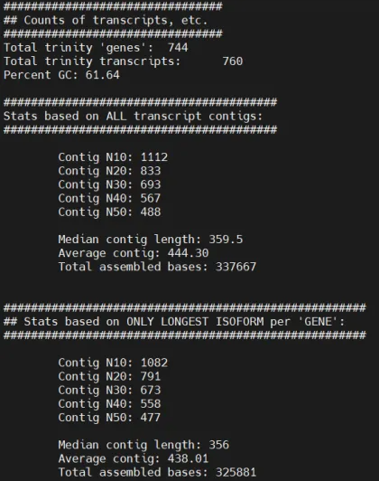
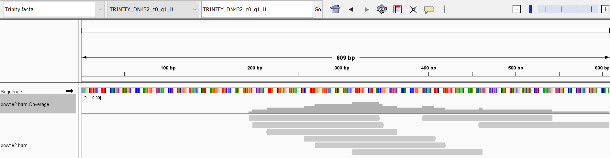
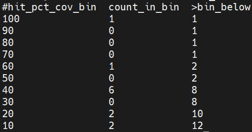
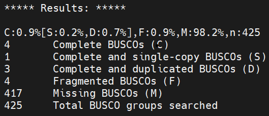
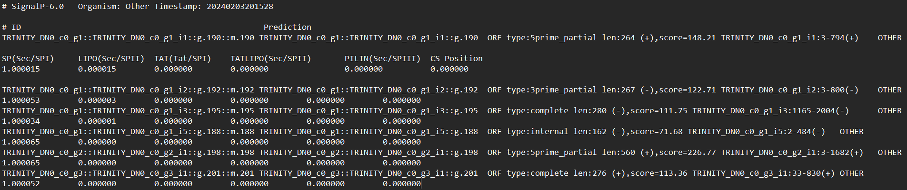

## Introduction

### Background

It is known that the type of light (red, blue and white) with which some plants such as *Spirodela polyrhiza* are irradiated affects functions such as growth and certain physiological processes by producing responses in the transcriptome. This may be of great interest for the different applications that *S.polyrhiza* may have, especially in the area of energy sources.

### Objective

The aim of this work is to perform de novo assembly of the transcriptome of the duckweed species, *Spirodela polirhyza*.

## Materials y Methods

### Experimental Design and Workflow

According to the reference paper (Zhong et al. 2022), the SRA accession number from which the data is obtained is SRR15716419.sra. Seed 38 is used, according to the sum of the digits of the DNI of a group member. This is done in order to have a reproducible study despite the fact that a random sequence is produced.

The workflow will consist of the following steps:

To perform the assembly, we will first download our survey data, thus getting the SRA. Then we will get the Paired-End readings in .fastq format and finally we will subsample the data according to our seed. The second step is to verify, filter and check our sequence, in order we will perform a quality analysis with fastqc, we will remove the kernels that give problems generated by sequencing errors. We will also remove adapters and low quality sequences, mainly from the ends. We will discard the rRNAs and finish by checking again with fastqc that the filtered sequences have improved with respect to the original sequences.

We will then proceed with normalisation, a crucial step to ensure that the observed differences in gene expression accurately reflect real biological variations. Normalisation will adjust our data to avoid bias and ensure more accurate comparisons. Once all these steps are done, we start with the de novo assembly of the transcriptome using the TRINITY programme, and check that the results are correct.

Next, we will verify that the quality of the assembly is correct with different tools (BUSCO). The last step is the functional annotation of the transcriptome. To do this, we will identify coding regions in the ORFs thanks to TransDecoder. With BLAST we will try to find homologous sequences. And with SignalIp6 we will make signal peptide predictions. With Trinotate we will prove that all these steps can also be done automatically and more easily, generating the reports with which to study the functional annotation of *Spirodela polyrhiza*.

 

The commands used for the analysis are shown below:

```{bash, eval=FALSE, engine="sh"}

# Download R

SRA=SRR15716419
prefetch -p -v $SRA
fasterq-dump  -e 4 --progress --split-3  ./SRR15716419.sra

# Subsampling
seqtk sample -s 38 SRR15716419_1.fastq 20000 > sub_SRR15716419_1.fastq
seqtk sample -s 38 SRR15716419_2.fastq 20000 > sub_SRR15716419_2.fastq

sed -i -r 's/(^[\@\+]SRR\S+)/\1\/1/' sub_SRR15716419_1.fastq
sed -i -r 's/(^[\@\+]SRR\S+)/\1\/2/'  sub_SRR15716419_2.fastq

# Quality Verification
fastqc --outdir=./quality_check sub_SRR15716419_1.fastq sub_SRR15716419_2.fastq

# Elimination of erroneous kmers
perl ~/denovo/software/run_rcorrector.pl -1 sub_SRR15716419_1.fastq -2 sub_SRR15716419_2.fastq

# Elimination of low-quality adapters and sequences
mkdir trimmed_data
cp ~/denovo/software/TruSeq3-PE.fa .

java -jar ~/denovo/software/trimmomatic-0.39.jar PE -threads 2 -trimlog ./trimmed_data/trimmomatic.log sub_SRR15716419_1.cor.fq  sub_SRR15716419_2.cor.fq ./trimmed_data/sub_SRR15716419_1P.qtrim.fq.gz ./trimmed_data/sub_SRR15716419_1U.qtrim.fq.gz ./trimmed_data/sub_SRR15716419_2P.qtrim.fq.gz ./trimmed_data/sub_SRR15716419_2U.qtrim.fq.gz \ILLUMINACLIP:TruSeq3-PE.fa:2:30:10 SLIDINGWINDOW:4:20 LEADING:15 TRAILING:15 MINLEN:130

# rRNA elimination
sortmerna  --ref ~/denovo/denovo_DB/rRNA_db/rfam-5.8s-database-id98.fasta --ref ~/denovo/denovo_DB/rRNA_db/silva-euk-18s-id95.fasta --ref ~/denovo/denovo_DB/rRNA_db/silva-euk-28s-id98.fasta --reads ./trimmed_data/sub_SRR15716419_1P.qtrim.fq.gz --reads ./trimmed_data/sub_SRR15716419_2P.qtrim.fq.gz --aligned rRNA --fastx  --other ./cleanedrRNA.fastq --threads 2 -v  --out2 --workdir ./rmRNA

rm -rf rmRNA

# We recheck the quality
fastqc -t 5 --outdir=./quality_check cleanedrRNA.fastq_fwd.fq.gz cleanedrRNA.fastq_rev.fq.gz

# Normalization
TRINITYPATH=/home/fran/opt/trinityrnaseq-Trinity-v2.8.4

$TRINITYPATH/util/insilico_read_normalization.pl --seqType fq  --CPU 15  --JM 60G  --max_cov 20 --left cleanedrRNA.fastq_fwd.fq.gz  --right cleanedrRNA.fastq_rev.fq.gz  --output ./normalization_reads --pairs_together --PARALLEL_STATS

# Number of normalised readings
echo $(cat ./normalization_reads/left.norm.fq|wc -l)/4|bc
# 13560
echo $(cat ./normalization_reads/right.norm.fq|wc -l)/4|bc
# 13560

# Number of readings before normalisation
echo $(gunzip -c cleanedrRNA.fastq_fwd.fq.gz|wc -l)/4|bc
# 15244
echo $(gunzip -c cleanedrRNA.fastq_rev.fq.gz|wc -l)/4|bc
# 15299
```

To perform the assembly with TRINITY, we use the following script:

```{bash, eval=FALSE, engine="sh"}

# De novo transcriptome assembly with Paired-End sequences
#!/bin/bash
mkdir trinity_out

TRINITY_DIR=/home/fran/opt/trinityrnaseq-Trinity-v2.8.4

DATPATH=$HOME/grupo5/tarea3/normalization_reads

$TRINITY_DIR/Trinity --seqType fq --no_normalize_reads \
--left  $DATPATH/left.norm.fq \
--right $DATPATH/right.norm.fq \
--SS_lib_type RF \
--max_memory 2G \
--CPU 2 \
--output ./trinity_out

```

```{bash, eval=FALSE, engine="sh"}

# Instructions for running the script
chmod +x run_trinity.sh
nohup ./run_trinity.sh >& my_trinity_script.log &

# We check the result of the assembly
more Trinity.fasta
rm -rf -v !("Trinity.fasta")

# Quality of assembly
# Statistical summary
$TRINITY_DIR/util/TrinityStats.pl ./trinity_out/Trinity.fasta

# Representing the readings
bowtie2-build ./trinity_out/Trinity.fasta trinity
DATPATH=$HOME/grupo5/tarea3/normalization_reads/
bowtie2 --local --no-unal -x trinity  -q -1  $DATPATH/left.norm.fq -2 $DATPATH/right.norm.fq | samtools view -b | samtools sort -o bowtie2.bam

$TRINITY_DIR/util/misc/SAM_nameSorted_to_uniq_count_stats.pl  bowtie2.bam

samtools index bowtie2.bam # indexing of the mapping, subsequently displayed with IGV

# We estimate the number of complete coding transcripts
 makeblastdb -in ~/denovo/denovo_DB/mini_spiro.fasta -dbtype prot
 
 blastx -query trinity_out/Trinity.fasta \
  -db ~/denovo/denovo_DB/mini_spiro.fasta -out blastx.outfmt6 \
  -evalue 1e-20 -num_threads 1 -max_target_seqs 1 \
  -outfmt 6

 $TRINITY_DIR/util/analyze_blastPlus_topHit_coverage.pl        blastx.outfmt6 trinity_out/Trinity.fasta      ~/denovo/denovo_DB/mini_spiro.fasta | column -t

# BUSCO 
mkdir BUSCO_trinity
busco -i trinity_out/Trinity.fasta -l ~/denovo/denovo_DB/viridiplantae_odb10 -m transcriptome -o trinityBUSCO --cpu 2

# Functional annotation of the transcriptome
# Identification of coding regions in the transcriptome
 TransDecoder.LongOrfs -t ./trinity_out/Trinity.fasta
 TransDecoder.Predict -t ./trinity_out/Trinity.fasta
 
# Sequence homology
blastx -db /home/omicas/denovo/denovo_DB/mini_spiro.fasta \
> -query trinity_out/Trinity.fasta -num_threads 2 \
> -max_target_seqs 1 -outfmt 6 -evalue 1e-5 > swissprot.blastx.outfmt6

blastp -query Trinity.fasta.transdecoder.pep -db /home/omicas/denovo/denovo_DB/mini_spiro.fasta -num_threads 2 \
-max_target_seqs 1 -outfmt 6 -evalue 1e-5 > swissprot.blastp.outfmt6

 hmmscan --cpu 2 --domtblout TrinotatePFAM.out  \
 /home/omicas/denovo/denovo_DB/Pfam-A_mini.hmm   \
 Trinity.fasta.transdecoder.pep
 
# Signal peptide prediction
 mkdir trinity_signalp
 signalp6 --fastafile Trinity.fasta.transdecoder.pep --organism other --output_dir ./trinity_signalp --format txt --mode fast

# Trinotate 
# Loading of transcripts and coding regions
export TRINOTATE_HOME=/home/fbalao/Programas/Trinotate-Trinotate-v3.2.2/
cp /home/omicas/denovo/denovo_DB/Trinotate.sqlite  mytrinotate.sqlite
chmod 644 mytrinotate.sqlite

TRINITY_DIR=/home/fran/opt/trinityrnaseq-Trinity-v2.8.4
DATA=/home/omicas/grupo5/tarea3/trinity_out/

$TRINITY_DIR/util/support_scripts/get_Trinity_gene_to_trans_map.pl  $DATA/Trinity.fasta >  $DATA/Trinity.fasta.gene_trans_map

$TRINOTATE_HOME/Trinotate mytrinotate.sqlite init --gene_trans_map $DATA/Trinity.fasta.gene_trans_map --transcript_fasta $DATA/Trinity.fasta --transdecoder_pep ./Trinity.fasta.transdecoder.pep

# Loading of homologies with BLAST
DATA=/home/omicas/grupo5/tarea3/
$TRINOTATE_HOME/Trinotate mytrinotate.sqlite LOAD_swissprot_blastx $DATA/swissprot.blastx.outfmt6  

$TRINOTATE_HOME/Trinotate mytrinotate.sqlite  LOAD_swissprot_blastp $DATA/swissprot.blastp.outfmt6
$TRINOTATE_HOME/Trinotate mytrinotate.sqlite LOAD_pfam TrinotatePFAM.out

# Loading of predicted signal peptides
$TRINOTATE_HOME/Trinotate mytrinotate.sqlite LOAD_signalp ./trinity_signalp/prediction_results.txt

# Report generation
$TRINOTATE_HOME/Trinotate mytrinotate.sqlite report  > trinotate_annotation_report.xls
$TRINOTATE_HOME/util/count_table_fields.pl trinotate_annotation_report.xls > "trinotate_annotation_report_table_fields.txt"

```

## Results

### De novo transcriptome



We can highlight from the summary statistic the small average size of the reads (around 400) because we have very short sequences. This indicates that the assembly suggests that it is of low quality.



As can be seen in the image there is a low percentage of mapping of our transcriptome, indicating that it is fragmented. In order to improve this, it is necessary to sequence in greater depth.



In this table we can see the number of proteins that map to a Trinity transcript at different length percentages. In our case, we only found one complete protein in the transcripts (indicative of low coverage). In the rest of the transcripts, we only found minor protein fragments, for example, 6 proteins with 40% coverage in the transcript. Both 20% and 10% have only 2 proteins each covering the transcript. In summary, we have only 12 proteins in total in our transcript, clearly indicating that the sequencing depth has been low and that the transcriptome is highly fragmented.



With BUSCO we quantify the complexity in terms of expected gene content of the transcriptomic assembly of *Spirodela polyrhiza*.

Looking at the BUSCO results, we realise that we have 98.2% missing values with this we can confirm that we have very poor reads in our transcript. The rest of the percentage is also mediocre, since we have 0.9% fragmented values and of our sequences that are complete and of interest to us only 0.2% are single copy sequences while 0.7% are duplicated sequences that do not really catch our attention either, since repeats generate contamination. The duplications may be due to chimeric assembly of haplotypes.

### Functional transcriptome annotation

After the sequence homology search, the file "swissprot.blastp.outfmt6" was obtained, which contains 20 protein sequences in the assembly with Trinity and the homologous sequences obtained from the SWISSPROT database.

The range of similarity percentages is quite varied, although there are some sequences with a very high similarity to the database. We will highlight 5 sequences that contain a similarity between 90 and 100%, all of them exceeding 200 points.

We then use the HMMER function to compare the homologous sequences with the data from the Pfam database, in order to know to which type of proteins the sequences with the highest scores belong.

In our case, the highest scoring proteins (622) are proteins belonging to the V-type aminotransferase family (Aminotran-5). Also noteworthy are several proteins with scores exceeding 400 points, which belong to proteins belonging to ATPases with numerous cellular activities (AAA).



The trinity_signalp directory was created and the signalp6 function was used to obtain a series of files. The file of interest in our case is "prediction results" which shows information on peptide prediction results.

In our example, we will analyse the prediction results of the first peptide, the results of which were as follows:

| #ID                                                   | #Prediction                                    | #OTHER                                                                         | SP(Sec/SPI) | LIPO(Sec/SPII) | TAT(Tat/SPI) | TATLIPO(Sec/SPII) | PILIN(Sec/SPIII) |
|---------|---------|------------|---------|---------|---------|---------|---------|
| TRINITY_DN0_c0_g1::TRINITY_DN0_c0_g1_i1::g.190::m.190 | TRINITY_DN0_c0_g1::TRINITY_DN0_c0_g1_i1::g.190 | ORF type:5prime_partial len:264 (+),score=148.21 TRINITY_DN0_c0_g1_i1:3-794(+) | 1.000015    | 0.000015       | 0            | 0                 | 0                |

The results are for the protein whose identifier is TRINITY_DN0_c0_g1::TRINITY_DN0_c0_g1_i1::g.190::m.190. The table indicates that the signal peptide found within the sequence is most likely to be a type 1 signal peptide, as it is in that cell that the value is highest with respect to the other peptide types.

With the Trinotate function, an automated statistical report of all functional annotations was obtained:

| transcript_id        | 760 |
|----------------------|-----|
| #gene_id             | 760 |
| #prot_coords         | 436 |
| SignalP              | 436 |
| prot_id              | 436 |
| sprot_Top_BLASTX_hit | 33  |
| Pfam                 | 32  |
| sprot_Top_BLASTP_hi  | 20  |
| gene_ontology_Pfam   | 0   |
| eggnog               | 0   |
| gene_ontology_BLASTX | 0   |
| peptide              | 0   |
| TmHMM                | 0   |
| gene_ontology_BLASTP | 0   |
| Kegg                 | 0   |
| transcript           | 0   |
| RNAMMER              | 0   |

[Trinotate annotation report.](trinotate_annotation_report.xls)

In the excel we can see different items in the columns with their respective data, such as the id of each gene, the id of each transcript, the id and coordinates of the proteins, the pfam results and the type of signal peptide among other information.

## Conclusions

In this task, short reads have been used to perform a de novo assembly of the transcriptome of *Spirodela polyrhiza*, and the quality of the transcriptome has been analysed. The transcriptome obtained was of very low quality, as indicated, among other data, by the poor representation of the reads and the fact that almost none of the genes that the organism should have (BUSCO) were found. As for functional annotation, hardly any results were found with BLAST. Among the genes identified by BLAST, we found peroxidases (such as Q43158) and glutamate synthase (A0A7I8KY56). It is possible that these transcripts were well reconstructed because they were highly expressed under the conditions of the study.

We can compare the analysis performed in this task with the class example, in which an assembly of the *Helianthus annuus* transcriptome was performed.

**Quality of the reads**. In both cases, the quality of the reads is good and the same parameters have been used for trimmomatic filtering.

**Quality of the assembly**. In both cases, a very low number of readings (20,000 - 100,000) is taken compared to the totals obtained in the study. For this reason, the transcriptome assembly is of very poor quality. In both the *Spirodella* and *Helianthus* assemblies, only a low percentage of the reads (well below 70%, which would be considered a good value) can be mapped.

**Functional annotation**. As the assembly has been poor in both cases, a large number of ORFs are not detected in the contigs obtained, and hardly any results are obtained when using BLAST.

In conclusion, a low number of reads have been used in the de novo assemblies of *Spirodela polirhyza* and *Helianthus annuus*, resulting in very low quality transcriptomes.

## References

Zhong, Y. et al., 2022. Physiological responses and transcriptome analysis of *Spirodela polyrhiza* under red, blue, and white light. *Planta* 255, 1--15. <https://doi.org/10.1007/s00425-021-03764-4>
